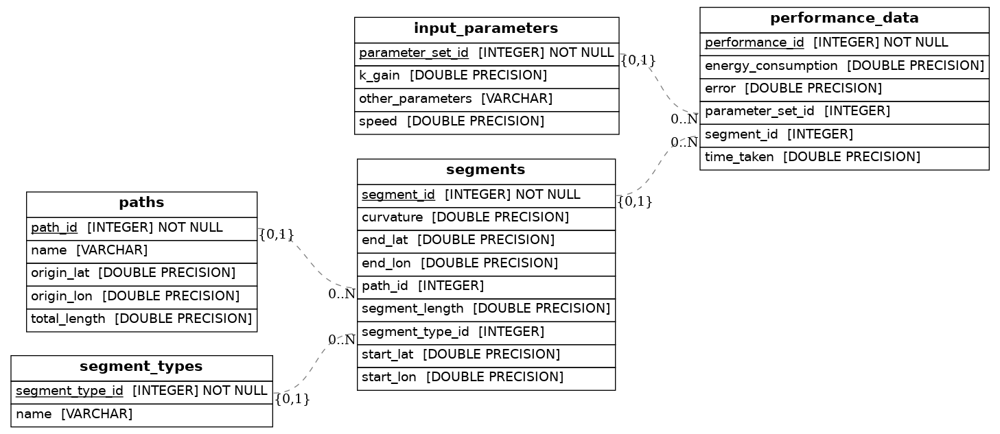

# Database Schema and ER Diagram

The database is structured to manage data related to ```paths``` and ```segments```, with a straightforward relational schema.

1. ```paths``` **Table**:

- Stores basic information about each path.
- Columns: ```id```, ```name```, ```origin_lat```, ```origin_lon```, ```total_length```.

2. ```segments``` **Table**:

- Stores details for each segment associated with a path.
- Columns: ```id```, ```path_id``` (foreign key), ```start_lat```, ```start_lon```, ```end_lat```, ```end_lon```, ```curvature```, ```segment_length```.

## ER Diagram
An ER Diagram is available in the ```images/``` folder, showing the relationships between the different tables: 

